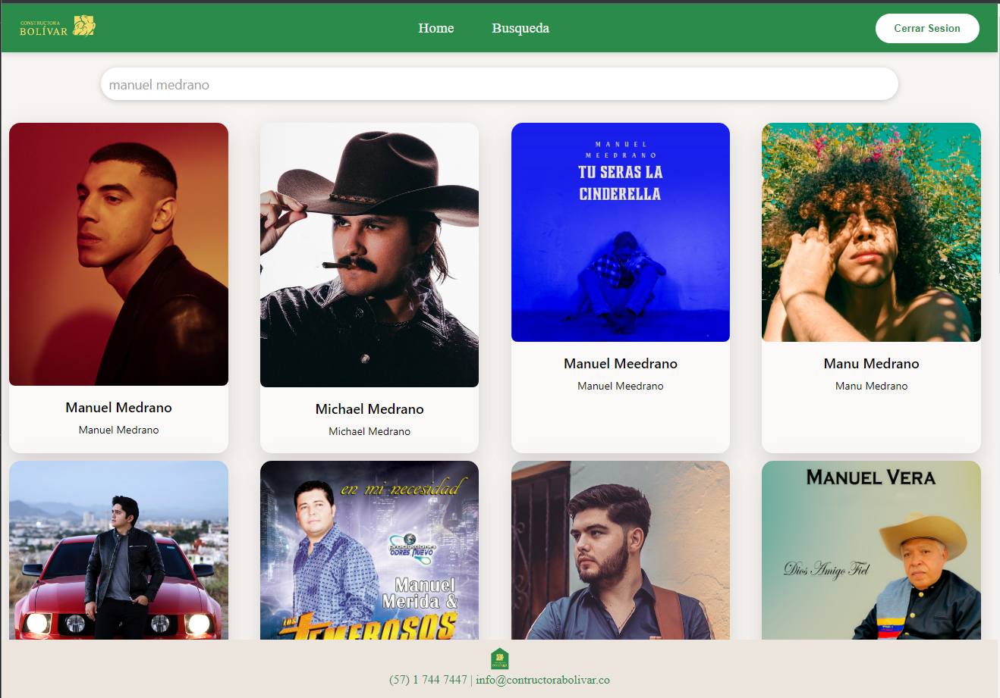

## Tecnologias Utilizadas

* Next Js
* React Js
* Typescript
* Redux Toolkit
* Git
* React Testing Library
* Jest
* Scss
* Spotify (api)
* Docker

## Dockerizacion

el repositorio cuenta con un archivo Dockerfile para que se pueda crear imagen y subir container
de igual forma cuenta con docker-comspose.yml (recomendado extension de visual studio code - extension docker)

docker-compose up --build -d

## Imagenes relacionadas al proyecto

